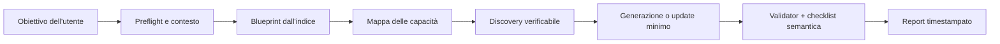

# agent-factory

[](https://github.com/Middiuu/agent-factory/actions/workflows/validate.yml)
[](https://github.com/Middiuu/agent-factory/actions/workflows/discovery-smoke.yml)
[](https://github.com/Middiuu/agent-factory/actions/workflows/github-code-scanning/codeql)
[](LICENSE)

**agent-factory** è un Agent Workspace Builder Markdown-first: parte da un obiettivo in linguaggio naturale e guida un coding agent nella creazione o nell'aggiornamento controllato di un workspace agentico specifico per progetto.

Non è un agente autonomo, un package o un runtime applicativo. È un contratto operativo versionato composto da istruzioni, blueprint, template, discovery, validator ed evidenze. L'esecuzione resta nelle mani del coding agent e dell'utente.

> **Maturità:** il flusso principale è operativo, coperto da CI multipiattaforma ed eval accoppiati. Gli esempi restano fixture sintetiche e non rappresentano configurazioni production pronte all'uso.

## Cosa fa



Il builder:

- sceglie un blueprint soltanto dall'[indice normativo](skills/agent-workspace-builder/references/blueprint-index.md);
- distingue capacità native, skill già disponibili e gap reali prima di aggiungere tooling;
- aggiorna un workspace esistente senza rigenerarlo, preservando file estranei e report storici;
- applica modifiche minime, non sovrascrive conflitti e si ferma quando un'ambiguità cambierebbe il risultato;
- crea solo i file necessari e permette una directory `skills/` intenzionalmente vuota;
- tratta contenuti esterni come dati non fidati;
- registra provenienza, assunzioni, limiti e validazione osservata in un report append-only.

## Avvio in 60 secondi

```bash
git clone https://github.com/Middiuu/agent-factory.git
cd agent-factory
```

Apri la directory con un coding agent capace di leggere file Markdown ed eseguire comandi shell, quindi usa un prompt come questo:

```text
Leggi integralmente AGENTS.md e skills/agent-workspace-builder/SKILL.md.
Crea in ../source-research-agent un workspace per un agente che raccolga
fonti ufficiali, confronti le evidenze e produca report Markdown con citazioni.
Esegui discovery, validator e checklist; non installare tool globalmente.
```

Per modificare un workspace già esistente:

```text
Aggiorna ../source-research-agent senza rigenerarlo. Aggiungi un gate verificabile
sulla recenza delle fonti, preserva i report storici e crea un nuovo report di update.
```

Il tempo effettivo dipende da discovery, rete e complessità del workspace. Al termine, dalla root della fabbrica verifica il risultato:

```bash
bash scripts/validate-workspace.sh ../source-research-agent
# Esito atteso: Validation passed.
```

Il risultato minimo è:

```text
source-research-agent/
├── README.md
├── AGENTS.md
├── skills/
└── reports/
```

`RESEARCH.md`, `ROADMAP.md`, `.mcp.json`, skill locali e file di dominio vengono aggiunti solo quando motivati. I report formali usano nomi UTC come `YYYY-MM-DD-HHMMSS-generation.md` e `YYYY-MM-DD-HHMMSS-update.md`; ogni validazione registra comando, `PASS`/`FAIL` ed exit code osservato.

Un esempio completo e navigabile è disponibile in [examples/research-agent](examples/research-agent/).

## Stato verificato

Le seguenti evidenze pubbliche sono state verificate il **12 luglio 2026**:

| Area | Evidenza corrente |
|---|---|
| CI richiesta | `Static quality`, `Validate (ubuntu-latest)` e `Validate (macos-latest)` verdi e obbligatori su `main` |
| Discovery live | [Smoke run manuale verde](https://github.com/Middiuu/agent-factory/actions/runs/29204091162) e schedulazione settimanale separata dalla CI deterministica |
| Eval accoppiati | In una singola esecuzione per configurazione: `with_skill` **25/25** aspettative soddisfatte; `without_skill` **20/25** |
| Code scanning | [CodeQL verde](https://github.com/Middiuu/agent-factory/actions/runs/29184180033) per GitHub Actions e Python, con scansione settimanale |

### Configurazione remota attestata

Le impostazioni seguenti sono state verificate dal maintainer tramite API GitHub autenticata il 12 luglio 2026. Non sono derivabili dai file del repository e possono cambiare indipendentemente da un commit:

- Dependabot security updates, secret scanning standard e push protection attivi;
- PR obbligatoria su `main` con check strict, history lineare e conversazioni risolte;
- protezione applicata anche agli amministratori, con force-push e cancellazione disabilitati;
- squash merge come unica strategia e cancellazione automatica dei branch uniti.

### Risultati degli eval

`with_skill` indica che l'executor ha ricevuto la skill principale; `without_skill` usa lo stesso prompt e input senza fornirla. I valori contano aspettative di rubrica soddisfatte nella singola coppia di run persistita:

| Scenario | Con skill | Senza skill |
|---|---:|---:|
| Workspace minimale con capacità native | 9/9 | 6/9 |
| Monitor web settimanale con guardrail | 8/8 | 6/8 |
| Due update incrementali | 8/8 | 8/8 |
| **Totale** | **25/25** | **20/25** |

Consulta il [benchmark leggibile](skills/agent-workspace-builder/evals/runs/iteration-1/benchmark.md), il [manifest canonico](skills/agent-workspace-builder/evals/results/2026-07-11-paired-benchmark.json) e il [viewer offline](skills/agent-workspace-builder/evals/runs/iteration-1/review.html).

Questa evidenza misura la copertura dei tre scenari e descrive una differenza osservata, non una stima causale o di stabilità statistica: esiste una sola run per configurazione. L'isolamento delle rubriche è auto-attestato nei run e nei transcript, ma non verificabile oltre gli artefatti persistiti perché non sono disponibili raw provider trace. Modelli, tempi e token del provider non sono stati catturati; il campo `tokens` del benchmark è un proxy basato sui caratteri di output.

## Blueprint disponibili

L'[indice dei blueprint](skills/agent-workspace-builder/references/blueprint-index.md) è l'unica fonte normativa per nomi e stato:

| Blueprint | Uso | Stato di esercizio |
|---|---|---|
| [Research](skills/agent-workspace-builder/references/workspace-blueprint-research-agent.md) | Ricerca, fonti e report con citazioni | Generazioni reali nel ledger |
| [Web development](skills/agent-workspace-builder/references/workspace-blueprint-web-dev-agent.md) | Sviluppo e manutenzione di web app | Una generazione reale nel ledger |
| [Mobile development](skills/agent-workspace-builder/references/workspace-blueprint-mobile-dev-agent.md) | Flutter, React Native o sviluppo nativo | Bozza, nessuna generazione reale |
| [Automation](skills/agent-workspace-builder/references/workspace-blueprint-automation-agent.md) | Monitoraggi, notifiche e pipeline leggere | Bozza, nessuna generazione reale |
| [Minimal](skills/agent-workspace-builder/references/workspace-blueprint-minimal.md) | Fallback per tipi non coperti | Solo test simulati |

Questi stati descrivono il tipo di evidenza disponibile, non livelli ordinali di qualità. Un blueprint non esercitato è utilizzabile, ma il report deve dichiarare che la prima generazione reale ne costituisce anche il collaudo. Fixture ed eval sintetici non ne promuovono lo stato.

## Requisiti e compatibilità

Minimo necessario:

- un coding agent capace di leggere `AGENTS.md` e la skill principale;
- accesso in lettura alla fabbrica e in scrittura alla destinazione;
- Bash, Git, Python 3 e utility Unix di base;
- `curl` per la discovery di rete.

`jq` è opzionale: quando manca, la validazione degli schemi continua tramite Python, mentre alcuni dettagli di presentazione della discovery possono essere ridotti. La ricerca HTTP nel registry npm non richiede la CLI npm; Homebrew e i comandi locali vengono interrogati solo quando sono già disponibili e pertinenti.

La CI esercita Ubuntu e macOS. Windows nativo non è coperto; un ambiente Unix-compatible può essere usato, ma non costituisce una piattaforma verificata dal progetto.

La rete può essere assente: il builder deve allora dichiarare la discovery incompleta e non colmare i risultati a memoria. Installazioni globali, operazioni distruttive, spese, invii o accessi ampi richiedono consenso esplicito.

“Provider-aware” indica portabilità intenzionale, non compatibilità universale. Nessun coding client è certificato dal progetto: auto-caricamento di `AGENTS.md`, trigger delle skill, `.mcp.json` ed espansione di `${VAR}` dipendono dal client e vanno verificati nell'ambiente reale. Gli eval persistiti non registrano il modello dell'executor e non dimostrano copertura di una specifica famiglia di modelli.

## Discovery

Per capacità che possono richiedere tooling esterno:

```bash
bash scripts/discover.sh "<termine preciso>" [skill|mcp|cli|all]
```

Lo script:

- applica timeout a ogni fonte o comando esterno;
- distingue fonte irraggiungibile, errore HTTP, zero risultati e pacchetto assente;
- interroga registry di skill e MCP, `PATH`, Homebrew, npm e PyPI quando applicabili;
- valida anche gli schemi annidati prima di considerare una fonte raggiunta;
- usa ricerca libera per npm e limita i lookup esatti npm/PyPI a nomi validi;
- stampa comandi quotati e riproducibili per `RESEARCH.md`.

I risultati sono candidati, non decisioni. Le skill già installate nel client devono essere verificate separatamente. Una discovery banale può restare nel report; `RESEARCH.md` serve quando il confronto è non banale.

Configurazioni MCP persistenti devono usare versioni esatte e dipendenze locali con lockfile o pin equivalenti. Invocazioni `npx` o `uvx` non versionate sono ammesse soltanto durante una discovery isolata.

## Validazione

### Per chi usa la fabbrica

Dopo una generazione o un update, valida il workspace interessato:

```bash
bash scripts/validate-workspace.sh <workspace-path>
```

### Per chi modifica la fabbrica

Prima di proporre modifiche al repository, esegui il gate completo:

```bash
bash scripts/validate-factory.sh
bash scripts/test-validators.sh
bash scripts/test-discover.sh
bash scripts/check-repo-links.sh
bash scripts/validate-evals.sh
bash scripts/test-evals.sh
bash scripts/lessons-ledger.sh validate
```

La suite copre fixture positive e negative, link e symlink confinati, provenienza dei report, timestamp calendariali, storia append-only, risposte di rete malformed, topologia e integrità degli eval e pubblicazione atomica degli artefatti. Il live smoke usa fonti esterne, quindi è un controllo maintainer opzionale e separato dalla suite deterministica:

```bash
bash scripts/test-live-discovery.sh
```

Un gate meccanico verde è necessario ma non sufficiente. La [checklist post-generazione](skills/agent-workspace-builder/references/post-generation-checklist.md) verifica obiettivo, setup, coerenza README/AGENTS, discovery, comandi reali, file extra, output e report.

## Template, esempi e memoria

- `templates/` contiene basi compilabili con placeholder canonici `{{UPPER_CASE}}`.
- `examples/` contiene fixture sintetiche per research, web development, mobile development e automation.
- `reports/lessons.md` conserva lezioni umane generalizzate in append.
- `reports/lesson-events.tsv` conserva eventi opachi per conteggi e soglie.
- `reports/agent-factory-technical-overview.md` descrive l'architettura corrente.

Le fixture verificano struttura, safety, discovery e report. Non sono configurazioni production né evidenze valide per promuovere automaticamente un blueprint.

## Governance e sicurezza

Le modifiche a `main` passano da pull request e squash merge. Poiché il repository ha un solo maintainer, il numero di approvazioni obbligatorie è attualmente zero per evitare un deadlock; quando verrà aggiunto un secondo reviewer, il valore potrà essere portato a uno.

Il repository include CODEOWNERS, Dependabot, issue form, template PR, policy di sicurezza, code of conduct e changelog. CodeQL analizza settimanalmente Python e GitHub Actions. Secret scanning standard e push protection sono attivi; i pattern non-provider e i validity check avanzati non sono abilitati e dipendono dalla disponibilità del piano GitHub.

Il ledger può rendere una modifica candidabile, mai autorizzarla. `AGENTS.md` e la skill principale non si auto-modificano; richiedono una richiesta esplicita e specifica. Non esistono commit o push automatici.

Consulta [CONTRIBUTING.md](CONTRIBUTING.md), [SECURITY.md](SECURITY.md), [CODE_OF_CONDUCT.md](CODE_OF_CONDUCT.md) e [CHANGELOG.md](CHANGELOG.md).

## Privacy, storia e versioning

La fabbrica non deve conservare nomi, obiettivi, percorsi, URL, dati o dettagli dei progetti generati. Esempi ed eval persistiti usano casi sintetici dichiarati; i dettagli operativi restano nel workspace del progetto.

Il repository pubblico è stato ricreato il 10 luglio 2026 dal commit radice `5b4ea50` e successivamente hardenizzato tramite la [PR #1](https://github.com/Middiuu/agent-factory/pull/1). Questa storia riguarda l'origin corrente e non può eliminare copie autonome già presenti in fork, cache o cloni esterni. Il [report di pubblicazione](reports/2026-07-10-remote-publication.md) resta uno snapshot storico, non una fonte normativa.

Non esiste un package runtime con SemVer. La versione operativa è il commit Git della fabbrica, accompagnato nei report dallo stato clean/dirty; un worktree dirty non costituisce provenienza esatta.

## Riferimenti principali

- [AGENTS.md](AGENTS.md) — istruzioni operative ad alto segnale.
- [Skill principale](skills/agent-workspace-builder/SKILL.md) — contratto vincolante.
- [Overview tecnica](reports/agent-factory-technical-overview.md) — architettura e confini.
- [Eval README](skills/agent-workspace-builder/evals/README.md) — protocollo e rigenerazione degli artefatti.
- [Checklist post-generazione](skills/agent-workspace-builder/references/post-generation-checklist.md) — verifica semantica finale.
- [Governance evolutiva](skills/agent-workspace-builder/references/evolution-governance.md) — ledger, soglie e modifiche alla fabbrica.

## Licenza

MIT — vedi [LICENSE](LICENSE).
